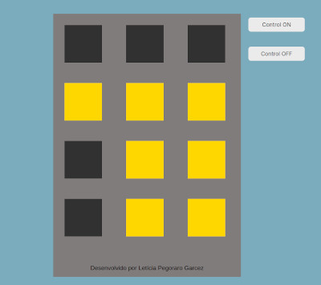

# Desafio de estágio Front-end aftersale

 

## O que é este projeto?

Este projeto é uma interface gráfica simples simulando um prédio com doze janelas, que podem estar acesas ou apagadas de acordo com o horário do dia em que o usuário se encontra. O projeto é desenvolvido com:

- HTML 5;
- CSS 3;
- Javascript;
- IDE Visual Studio Code.

## Como este projeto fuciona?

Este projeto utiliza a geolocalização do navegador para solicitar à Sunsirse Sunset API os horários do nascer e do por do sol. Após isso, é feita uma comparação com o horário atual. Caso esta comparação indique que é dia, todas as janelas iniciarão apagadas. Caso a comparação indique noite, todas as luzes estarão acesas.
Após a inicialização da página, você pode acender janelas apagadas ou apagar janelas acesas clicando sobre elas. Também existem dois botões de controle global, que acenderão todas as janelas, ou as apagarão.

## Como executar este projeto?

Faça o download dos arquivos em formato zip e os descompacte.
Para executar a aplicação, entre na pasta descompactada e abra o arquivo `index.html` clicando sobre ele duas vezes.
Aguarde o pop-up que indica que a página foi carregada com sucesso, e já pode utilizar a aplicação.
